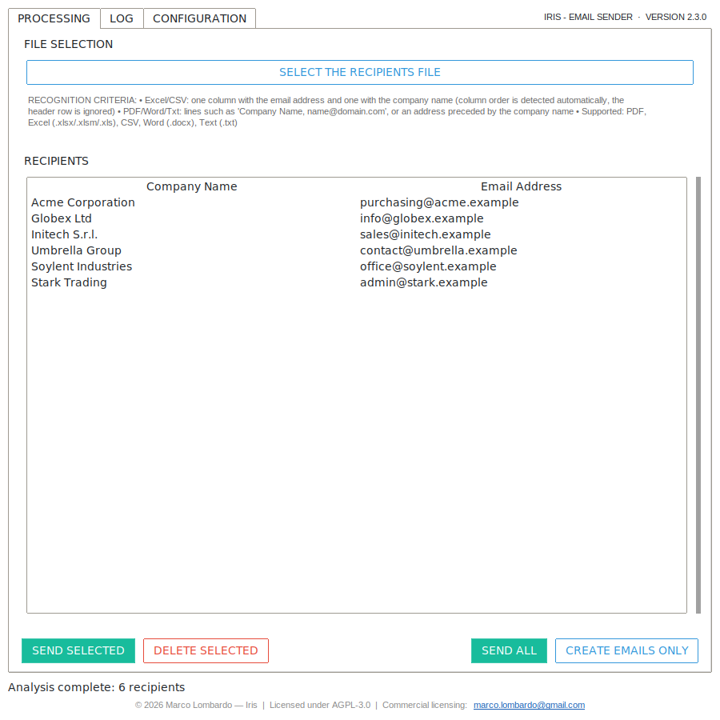
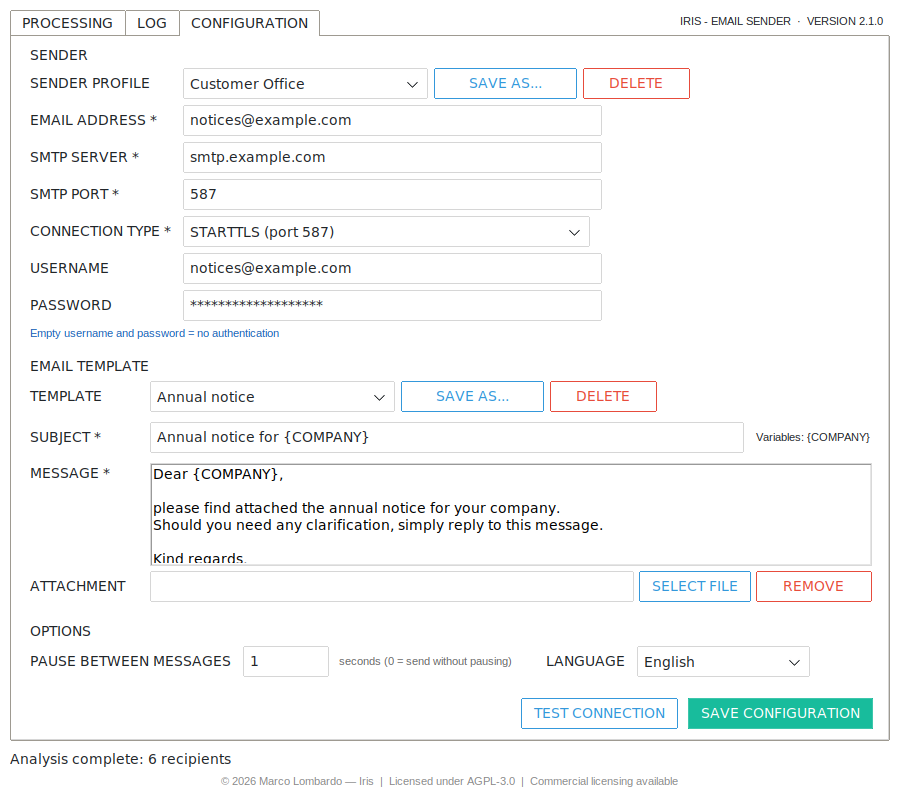
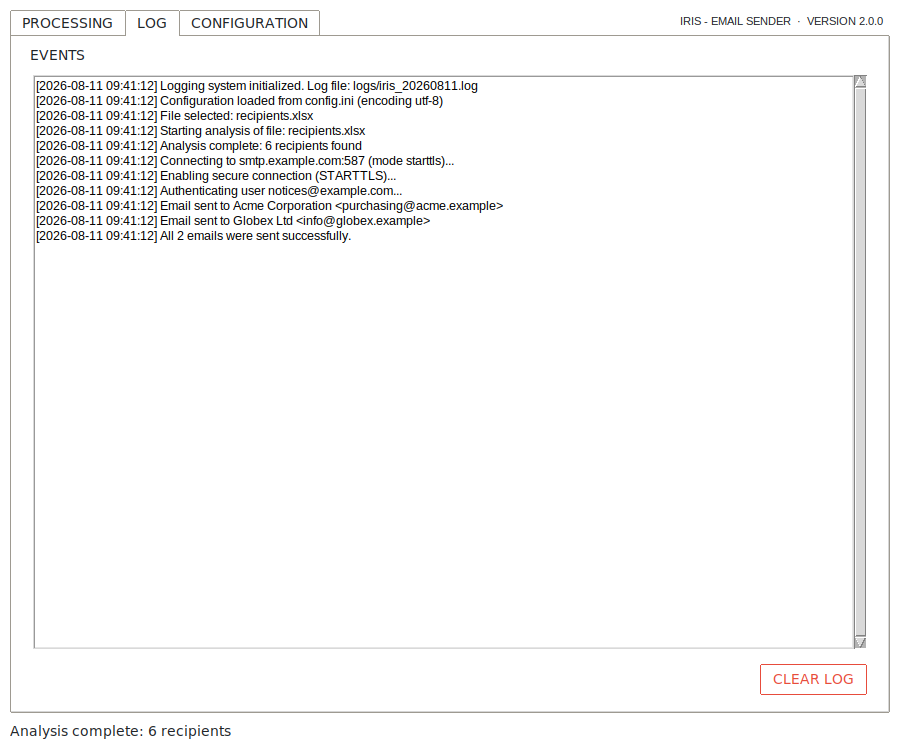
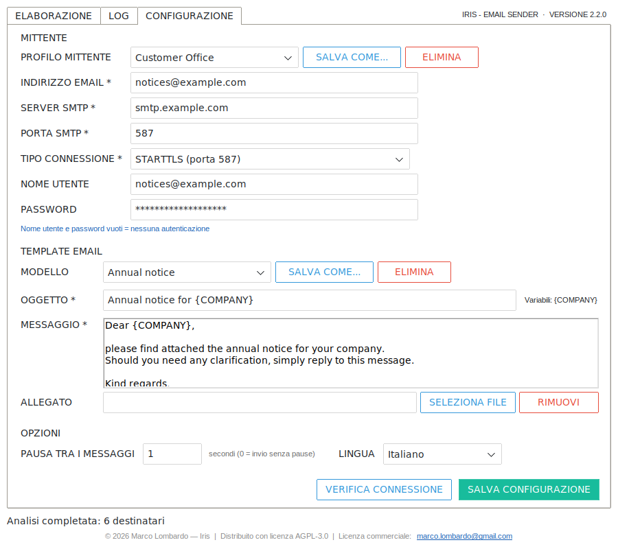

# Iris — Email Sender

[](https://www.gnu.org/licenses/agpl-3.0)
[](#license--commercial-licensing)
[](https://www.python.org/)
[](#testing)

**Iris** is a desktop application that turns a document full of company names and email addresses into a batch of personalised emails — and sends them, or writes them to disk for review.

Point it at a **PDF, Excel, CSV, Word or text file**; it extracts every *(company, address)* pair, fills in a template with the company name, and delivers the whole batch over a **single SMTP connection**. No mail-merge spreadsheet gymnastics, no per-recipient copy-and-paste.

The interface is available in **English (default)** and **Italian**, switchable at runtime from the Configuration tab.

---

## Screenshots

> All data shown below is fictitious: sample companies on the reserved `.example` domains, a fake SMTP server and a placeholder password. No real account, no real recipient.

| | |
|---|---|
| **Processing** — recipients extracted from a document, ready to send | **Configuration** — sender profiles, saved templates, `{COMPANY}`, send options |
|  |  |
| **Log** — every step, from parsing to the SMTP dialogue | **Italian interface** — the same screen after switching language |
|  |  |

<sub>Generated with [`docs/generate_screenshots.py`](docs/generate_screenshots.py), which boots the real application under Xvfb with in-memory sample data (no config written, no network calls). Regenerate after a UI change with `xvfb-run -a python docs/generate_screenshots.py`.</sub>

---

## Table of Contents

1. [Features](#features)
2. [Requirements](#requirements)
3. [Installation](#installation)
4. [Quick Start](#quick-start)
5. [Configuration](#configuration)
6. [Sender Profiles and Templates](#sender-profiles-and-templates)
7. [Input Formats](#input-formats)
8. [Sending](#sending)
9. [Creating Emails Without Sending](#creating-emails-without-sending)
10. [Language Switching](#language-switching)
11. [Where Files Are Stored](#where-files-are-stored)
12. [Security Notes](#security-notes)
13. [Architecture](#architecture)
14. [Testing](#testing)
15. [Building the Executable](#building-the-executable)
16. [Troubleshooting](#troubleshooting)
17. [Contributing](#contributing)
18. [License & Commercial Licensing](#license--commercial-licensing)
19. [Disclaimer](#disclaimer)

---

## Features

- **Multi-format parsing** — PDF, Excel (`.xlsx` / `.xlsm` / `.xls`), CSV, Word (`.docx`) and plain text (`.txt`)
- **Automatic extraction** of company names and email addresses, with column order detected by content rather than position
- **Personalised templates** — `{COMPANY}` in the subject and body is replaced per recipient
- **Template library** — save subject, message and attachment under a name and switch between them in one click
- **Sender profiles** — keep several SMTP configurations (work account, internal relay, a client's server) and swap them from a drop-down
- **Optional attachment** shared by every message
- **SMTP delivery** over SSL/TLS, STARTTLS or plain, with or without authentication
- **Connection test** that validates server and credentials without sending anything
- **Single-connection batches** with automatic reconnection and early abort on unrecoverable errors
- **Configurable pause between messages**, to stay under a provider's rate limit
- **Offline generation** — write `.msg` files (Outlook on Windows) or standard `.eml` files instead of sending
- **Bilingual interface** — English and Italian, switched at runtime
- **Full logging** — on screen and to a daily file
- **Persistent configuration** in `config.ini`, with every password stored obfuscated

Everything above is in the free, open-source build. There is no paid tier, no feature gate and no licence key — see [License & Commercial Licensing](#license--commercial-licensing) for what the commercial licence is actually for.

## Requirements

- **Python 3.10 or newer** with `tkinter` (only needed to run from source)
- Windows 10/11, Linux or macOS
  - `.msg` generation requires Windows with Outlook installed; everywhere else the app writes `.eml`
- Network access to your SMTP server

On Debian/Ubuntu, `tkinter` ships separately: `sudo apt-get install python3-tk`.

## Installation

### Option 1 — Executable (recommended for end users)

1. Copy `Iris.exe` into a folder of your choice
2. Run it: `config.ini` and `logs/` are created next to the executable on first use

### Option 2 — From source

```bash
git clone https://github.com/MarcoLombardoDev/Iris.git
cd Iris

python -m venv .venv
# Windows:        .venv\Scripts\activate
# Linux / macOS:  source .venv/bin/activate

pip install -r requirements.txt
python main.py
```

On Windows you can use the helper scripts `install_dependencies.bat` and `run.bat`.

### Dependencies

| Package | Used for | If missing |
|---|---|---|
| `PyMuPDF` | PDF parsing | PDFs cannot be read (explicit message) |
| `openpyxl` | `.xlsx` / `.xlsm` parsing | Those formats cannot be read |
| `xlrd` | `.xls` parsing (binary format) | `.xls` files cannot be read |
| `python-docx` | `.docx` parsing | `.docx` files cannot be read |
| `ttkbootstrap` | Modern theme | Falls back to the standard `ttk` look |
| `Pillow` | Required by ttkbootstrap to build its theme | Theme falls back to plain `ttk` |
| `pywin32` | `.msg` generation via Outlook (Windows only) | `.eml` files are produced instead |

Every dependency is imported where it is used: a missing library degrades one feature instead of preventing the application from starting.

## Quick Start

1. **Configure the sender** — open the *Configuration* tab, fill in your SMTP server, port, connection type and (optionally) credentials.
2. **Write the template** — a subject and a message, using `{COMPANY}` wherever the recipient's name belongs.
3. **Test the connection** — press `TEST CONNECTION`; nothing is sent, but server and credentials are verified.
4. **Save** — `SAVE CONFIGURATION` writes `config.ini`, reloaded automatically next time.
5. **Load the recipients** — go to *Processing*, press `SELECT THE RECIPIENTS FILE` and pick your document. Extraction runs in the background.
6. **Send** — `SEND ALL`, or select rows and use `SEND SELECTED`. Successfully sent rows disappear from the list; failures stay, with the reason in the *Log* tab.

## Configuration

All settings live in the *Configuration* tab. Fields marked `*` are required.

### Sender

| Field | Description |
|---|---|
| **SENDER PROFILE** | Recall a saved set of sender settings — see [Sender Profiles](#sender-profiles-and-templates) |
| **EMAIL ADDRESS** * | Address shown as the sender; must be syntactically valid |
| **SMTP SERVER** * | Outgoing mail server host name |
| **SMTP PORT** * | Port number (1–65535) |
| **CONNECTION TYPE** * | `SSL/TLS`, `STARTTLS` or `None` |
| **USERNAME** | Login for authentication — leave empty if the server does not require it |
| **PASSWORD** | Password for that login |

> Username and password must be **both filled in or both empty**. Empty means the message is sent without authentication, as internal relays usually expect.

Common provider settings:

| Provider | Server | Port | Connection |
|---|---|---|---|
| Gmail | `smtp.gmail.com` | 587 | STARTTLS |
| Outlook / Hotmail | `smtp-mail.outlook.com` | 587 | STARTTLS |
| Microsoft 365 | `smtp.office365.com` | 587 | STARTTLS |
| Generic implicit TLS | (your host) | 465 | SSL/TLS |
| Internal relay | (your host) | 25 | None |

Gmail and Microsoft 365 require an **app password** when two-factor authentication is enabled; the account password is rejected.

### Email template

| Field | Description |
|---|---|
| **TEMPLATE** | Recall a saved template — see [Templates](#sender-profiles-and-templates) |
| **SUBJECT** * | Subject line, may contain `{COMPANY}` |
| **MESSAGE** * | Plain-text body, may contain `{COMPANY}` |
| **ATTACHMENT** | Optional file attached to every message |

```
Subject:  Annual notice for {COMPANY}
Message:  Dear {COMPANY},
          please find attached the annual notice for your company.
          Kind regards.
```

For the recipient "Acme Corporation" the subject becomes `Annual notice for Acme Corporation`.

> `{AZIENDA}` — the Italian placeholder used by version 1.x — is still accepted, so existing templates keep working.

### Options

| Field | Description |
|---|---|
| **PAUSE BETWEEN MESSAGES** | Seconds to wait between one message and the next. `0` sends the batch at full speed |
| **LANGUAGE** | Interface language, applied immediately |

A pause is the simplest cure for a provider that rate limits a sender: Gmail, Microsoft 365 and most shared relays are much happier with one message every second or two than with a hundred in a burst. The value accepts decimals (`0.5`), and the batch stays interruptible while it waits — pressing to close the window does not sit through the remaining seconds.

## Sender Profiles and Templates

Both the sender settings and the message can be saved under a name and recalled later, so switching between "the work account" and "the client's relay", or between an annual notice and a payment reminder, does not mean retyping anything.

| Button | Effect |
|---|---|
| **SAVE AS...** | Asks for a name and stores the fields currently on screen. An existing name is replaced after confirmation |
| **DELETE** | Removes the selected entry |

Picking an entry from the drop-down copies it into the fields below, where it can still be edited before sending — loading a profile or a template changes the form, never the file. Saving is immediate: the entry is written to `config.ini` straight away, and the fields you were editing elsewhere are left untouched.

- **Sender profiles** hold the address, server, port, connection type and credentials.
- **Templates** hold the subject, message and attachment path.

Names are free text; square brackets are dropped and runs of whitespace collapse, because the name becomes a section header inside `config.ini`.

```ini
[PROFILE:Customer Office]
sender_email = notices@example.com
smtp_server = smtp.example.com
smtp_port = 587
connection_type = starttls
smtp_password = b64:...

[TEMPLATE:Annual notice]
email_subject = Annual notice for {COMPANY}
email_body = Dear {COMPANY},...
```

> Profile passwords are obfuscated exactly like the main one — which is to say **not encrypted**. A `config.ini` holding several accounts is that much more sensitive; see [Security Notes](#security-notes).

## Input Formats

Supported extensions: `.pdf`, `.xlsx`, `.xlsm`, `.xls`, `.csv`, `.docx`, `.txt`.

### Excel and CSV (most reliable)

| Company Name | Email |
|---|---|
| Acme Corporation | purchasing@acme.example |
| Globex Ltd | info@globex.example |

- **Column order does not matter**: the address is found by content, and the company name is the first non-empty cell that is not an address.
- The **header row is ignored automatically** — it holds no valid address — so it may be present or absent.
- **All sheets** of the workbook are scanned.
- Rows without a valid address are skipped.
- In CSV files the delimiter (`;`, `,`, tab, `|`) is detected automatically.

### PDF, Word and text

One recipient per line, name and address separated by `,` `;` tab or `|`:

```
Acme Corporation, purchasing@acme.example
Globex Ltd; info@globex.example
Initech S.r.l.	sales@initech.example
Umbrella Group | contact@umbrella.example
```

Without a separator, the text preceding the address on the same line becomes the company name:

```
Acme Corporation   purchasing@acme.example
```

In PDFs, when the address sits alone on its line, the name is looked up in the previous lines (up to three):

```
Acme Corporation
purchasing@acme.example
```

Word documents are scanned both as **tables** (treated like spreadsheet rows) and as **paragraphs**.

If no name can be determined, the address domain is used: `info@acme.example` becomes "Company Acme".

### Common rules

- **Duplicate addresses** are dropped, keeping the first occurrence (case-insensitive).
- Syntactically invalid addresses are ignored.
- Company names are trimmed of surrounding punctuation; a trailing dot is preserved, because it belongs to legal forms such as "S.r.l." or "Inc.".

## Sending

Before a batch starts, the configuration is validated: sender format, host, numeric port in range, subject and body present, attachment existing. Every problem is listed at once.

| Button | Effect |
|---|---|
| **SEND SELECTED** | Sends to the highlighted rows only (`Ctrl` / `Shift` for multiple selection) |
| **SEND ALL** | Sends to every recipient in the list, after confirmation |

While a batch runs:

- action buttons are disabled, so a batch cannot be started twice;
- the status bar shows progress (`Sending... 12/50`);
- every **successfully sent row is removed** from the list, so what remains is exactly what did not go out;
- the whole batch travels over **one SMTP connection** — considerably faster and less likely to trip provider rate limits;
- if the connection drops, the session reconnects and continues.

On an **unrecoverable error** (rejected credentials, unknown host, connection refused) the batch is aborted: the remaining recipients are reported as *not attempted* and stay in the list. Closing the window mid-batch asks for confirmation and stops after the message in flight.

## Creating Emails Without Sending

`CREATE EMAILS ONLY` writes one file per recipient and sends nothing — useful for a review pass, or to forward the messages manually.

- On **Windows with Outlook installed**, `.msg` files are produced, ready to open and send.
- Otherwise standard **`.eml`** files are written, which Outlook, Thunderbird and most clients open natively. The attachment is included in both formats.

Files land in the `emails/` folder, named after company and address (for example `Acme Corporation_purchasing_acme.example.eml`). Before generating, that folder is cleared of previously generated `.msg`/`.eml` files — **nothing else is touched**.

## Language Switching

The interface ships in **English (default)** and **Italian**. Pick a language from the *Configuration* tab: the whole window is redrawn immediately, keeping your settings, template and recipient list, and the choice is written to `config.ini` right away so the next start opens in the same language.

Translations live in a single file, [`iris/i18n.py`](iris/i18n.py), as one dictionary per language. Adding a language means adding a dictionary and registering it in `LANGUAGES`; the test suite checks that every catalogue defines exactly the same keys with the same placeholders.

## Where Files Are Stored

| Content | Location |
|---|---|
| Configuration | `config.ini`, next to the executable or the source tree |
| Daily logs | `logs/iris_YYYYMMDD.log` |
| Generated emails | `emails/` |

`config.ini` holds the settings currently in use in its `[EMAIL]` section, plus one `[PROFILE:name]` or `[TEMPLATE:name]` section per saved entry. It is looked up in the application folder, then the working directory, then the per-user folder — the first one found wins, so configurations written by earlier versions keep working. If the application folder is not writable (an executable under `C:\Program Files`, say), everything moves to `%APPDATA%\Iris` (`~/.config/Iris` on Linux/macOS). The path actually used is always reported in the *Log* tab at start-up.

## Security Notes

- **`config.ini` holds your mail credentials.** The password is stored **obfuscated** (base64, `b64:` prefix): that stops casual reading, it is **not encryption**. Treat the file as a secret — do not share it, do not commit it. It is already listed in `.gitignore`, and on POSIX systems it is created with `600` permissions.
- **Nothing is sent without an explicit action.** Analysis, template editing and the connection test never deliver a message.
- **No telemetry, no external service.** The application talks to your SMTP server and to nothing else.
- Recipient lists and generated emails stay on your machine.
- **Saved sender profiles multiply the exposure.** Each profile keeps its own password, obfuscated the same way, so a `config.ini` holding four accounts is four times the problem if it leaks. Do not put a `config.ini` with saved profiles on a shared drive or in a synced folder.

## Architecture

The graphical layer and the application logic are separate:

```
main.py              entry point, start-up error handling
iris/                the application package
├── gui.py           Tkinter interface (widgets, events, threads)
├── i18n.py          translation catalogues and helpers
├── parsers.py       recipient extraction from every supported format
├── mailer.py        message composition, validation, SMTP sessions
├── msgwriter.py     .msg / .eml writing
├── config_store.py  config.ini reading and writing
├── paths.py         paths for source and frozen builds
└── version.py       version number and application naming
```

`gui.py` is the only module that imports Tkinter. Everything else is plain logic, so it can be tested without a display, reused from scripts, and debugged with a test rather than by clicking.

**Concurrency.** Tkinter is not thread-safe, so the project follows one rule: long operations (parsing, sending, file generation, connection test) run on daemon threads, and every UI update is pushed through a queue drained by the main thread every 100 ms. Data read from widgets is collected on the main thread *before* a worker starts.

**Packaging.** `PIL._tkinter_finder` must stay in the PyInstaller hidden imports: without it `PIL.ImageTk` fails at runtime, ttkbootstrap cannot build its theme, and every themed widget raises — the executable will not start.

## Testing

```bash
pip install -r requirements-dev.txt
python -m pytest tests -v
```

On Linux the GUI tests need a display:

```bash
xvfb-run -a python -m pytest tests
```

Without a display the GUI tests are skipped automatically and the rest still runs. **No test ever sends a real email**: delivery is verified against a minimal in-process SMTP server.

| File | Tests | Coverage |
|---|---:|---|
| `tests/test_parsers.py` | 33 | Address validation, text, tables, PDF, CSV, `.xls`, unsupported formats |
| `tests/test_mailer.py` | 43 | Templates, validation, headers, non-ASCII text, attachments, bulk sending, pause between messages |
| `tests/test_gui_smoke.py` | 31 | Start-up, analysis, validation, configuration, sender profiles, templates, language switching, end-to-end send |
| `tests/test_config_store.py` | 37 | Save/reload, password obfuscation, encodings, language, saved profiles and templates, backward compatibility |
| `tests/test_i18n.py` | 19 | Catalogue consistency, placeholders, fallbacks |
| `tests/test_msgwriter.py` | 7 | `.eml`, attachments, fallback without Outlook, folder cleanup |
| `tests/test_smtp_integration.py` | 4 | Real SMTP dialogue, connection reuse, reconnection |

## Building the Executable

```bash
pip install -r requirements-dev.txt
python build.py            # or: pyinstaller Iris.spec
python build.py --clean    # remove build/ and dist/ only
```

The result is `dist/Iris.exe` (one file, no console). On Windows `compile.bat` runs the test suite before building.

> Do **not** run `pyinstaller --name=Iris main.py` from the project folder: it would overwrite `Iris.spec` with a generated file full of absolute paths. `build.py` avoids this by writing the temporary spec into `build/`.

The application icon is generated from primitives by [`assets/make_icon.py`](assets/make_icon.py), so the repository carries no third-party artwork.

## Troubleshooting

| Symptom | Cause / fix |
|---|---|
| `SMTP AUTH extension not supported` | The server wants no authentication: clear username and password |
| Authentication rejected | Wrong credentials; Gmail and Microsoft 365 need an app password with 2FA enabled |
| Timeout or connection refused | Wrong host/port, or a firewall in the way — use `TEST CONNECTION` to isolate it |
| No recipients found | The document does not match the recognised layouts; a two-column Excel/CSV file is the safest input |
| `.xls` file not read | Install `xlrd`: `pip install -r requirements.txt` |
| `.eml` produced instead of `.msg` | Outlook or `pywin32` unavailable; `.eml` opens in Outlook anyway |
| The window does not start | Run from a terminal to read the error; a missing `tkinter` is the usual cause on Linux |

The *Log* tab and `logs/iris_YYYYMMDD.log` record every operation in detail — attach the day's log file when reporting an issue.

## Contributing

Contributions are welcome. All contributors must agree to the [Contributor License Agreement (CLA)](CLA.md) before a Pull Request can be merged. The CLA grants the Project Owner the right to dual-license contributions under AGPL-3.0 and commercial terms — this is what makes the dual-licensing model sustainable.

> **To agree to the CLA:** include `I have read and agree to the Contributor License Agreement (CLA.md).` in your Pull Request description.

Practical expectations:

- Only `iris/gui.py` may import Tkinter; new logic goes in the other modules, with tests.
- Every bug fix arrives with a test that fails without the fix.
- User-facing strings go through `iris/i18n.py`, in **both** catalogues.
- Bump the version only in `iris/version.py`, and add a `CHANGELOG.md` entry.
- Never commit `config.ini`, real credentials, or real recipient lists.

## License & Commercial Licensing

Iris is open-source software released under the **[GNU Affero General Public License v3.0 (AGPL-3.0)](LICENSE)**.

Copyright © 2026 Marco Lombardo.

**The free build is the whole product.** Every feature documented above is in it. There is no paid edition, no feature gate, no licence key, no seat limit and no telemetry. If AGPL-3.0 works for you, you are done reading — Iris is yours to use.

### What AGPL-3.0 Means for You

| Use Case | Allowed? | Obligation |
|---|---|---|
| Personal / internal business use, any number of machines and users | ✅ Yes | None |
| Modify it for yourself | ✅ Yes | None |
| Fork & publish on GitHub | ✅ Yes | Must stay AGPL-3.0 |
| Redistribute it, modified or not, under AGPL-3.0 | ✅ Yes | Must ship the source |
| Deploy a modified version as a network service | ✅ Yes | Must publish the source of your modified version |
| Integrate into a **closed-source product** | ⚠️ Restricted | Requires a commercial licence |
| Offer as a **proprietary SaaS** without sharing source | ❌ Not under AGPL | Requires a commercial licence |
| **Resell** it, or ship it inside a product you sell | ❌ Not under AGPL | Requires a commercial licence |

The dividing line is one rule: **AGPL-3.0 is free as long as the source stays open.**

### Commercial Licensing

The commercial licence removes the copyleft obligation, and nothing else. It is for companies embedding Iris in a proprietary product, running a modified version as a service without publishing the source, or reselling it under their own terms.

| Licence | Scope | Price |
|---|---|---|
| **Community** | Everything Iris does, under AGPL-3.0 | **Free** |
| **Single Product** | Iris embedded in one proprietary product, one organisation | **€2,500 / year** |
| **SaaS & Redistribution** | Iris behind a service offered to third parties, or shipped inside a product you sell | **€4,000 / year** |
| **Perpetual** | Single Product scope, bought once — covers the version current at purchase | **€8,000 one-off** |

List prices, excluding VAT; the final figure is set in the signed agreement. Full terms, scope and what is *not* included are in **[COMMERCIAL-LICENSE.md](COMMERCIAL-LICENSE.md)**.

### How to get in touch

Everything commercial — buying a licence, asking for a quote, or checking whether you need one at all (the answer is often *no*) — goes to one address:

> **[marco.lombardo@gmail.com](mailto:marco.lombardo@gmail.com)** — Marco Lombardo

The same address is shown in the application's footer, and clicking it opens your mail client on a pre-filled enquiry. Please keep **GitHub Issues for bugs and feature requests**, not for licensing.

## Disclaimer

Iris sends **real emails to real recipients** as soon as you press `SEND ALL`. Verify your recipient list, your template and your SMTP settings before starting a batch — use `CREATE EMAILS ONLY` for a dry run and `TEST CONNECTION` to validate the server.

You remain responsible for the content you send and for complying with the applicable rules on electronic communications and personal data — including, in the EU, the GDPR and the consent requirements for unsolicited commercial email. The authors and contributors accept no liability for messages sent with this software, for delivery failures, or for any consequence of its use.

The software is provided "AS IS", without warranty of any kind, as stated in the [LICENSE](LICENSE).
